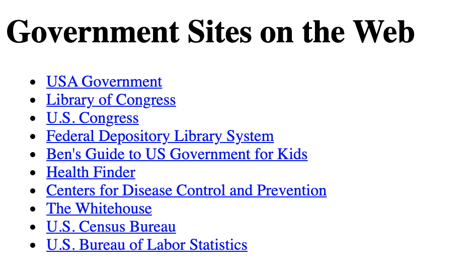

# t1-code-1
## Summary
Use HTML to create a navigation list of 10 government websites as shown in Figure 1-46. Each item in the list should act as a hypertext link to the government site.



Figure 1-46

The following are the URLs associated with each website:

- USA Government (https://www.usa.gov)
- Library of Congress (https://www.loc.gov)
- U.S. Congress (https://www.congress.gov)
- Federal Depository Library System (https://www.fdlp.gov)
- Ben's Guide to US Government for Kids (https://bensguide.gpo.gov)
- Health Finder (https://www.healthfinder.gov)
- National Center for Health Statistics (https://www.cdc.gov)
- The Whitehouse (https://www.whitehouse.gov)
- U.S. Census Bureau (https://www.census.gov)
- U.S. Bureau of Labor Statistics (https://www.bls.gov)

Do the following:

Save code1-1_txt.html as code1-1.html. Open the file *code1-1.html* and in the comment section enter your **name** (First + Last) and the **date** (MM/DD/YYYY) into the ```Author:``` and ```Date:``` fields of the file.
   
Within the ```body``` section of the file, enter the text **Government Sites on the Web**. Mark that text as an ```h1``` heading.
        
Place the list of government websites within an unordered list nested within a navigation list. Mark each government website as a separate list item.

Mark the text of each government site as a hypertext link using the ```<a>``` tag. Set the ```href``` attribute to the URLs specified above.

Verify the final website looks as designed.
