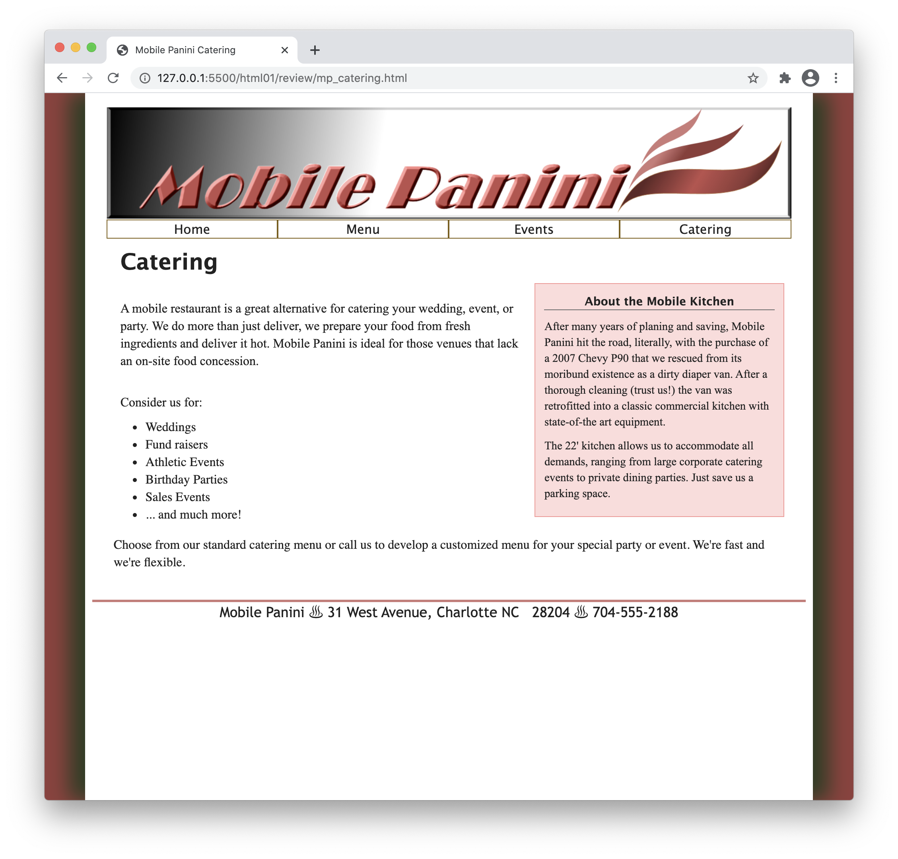
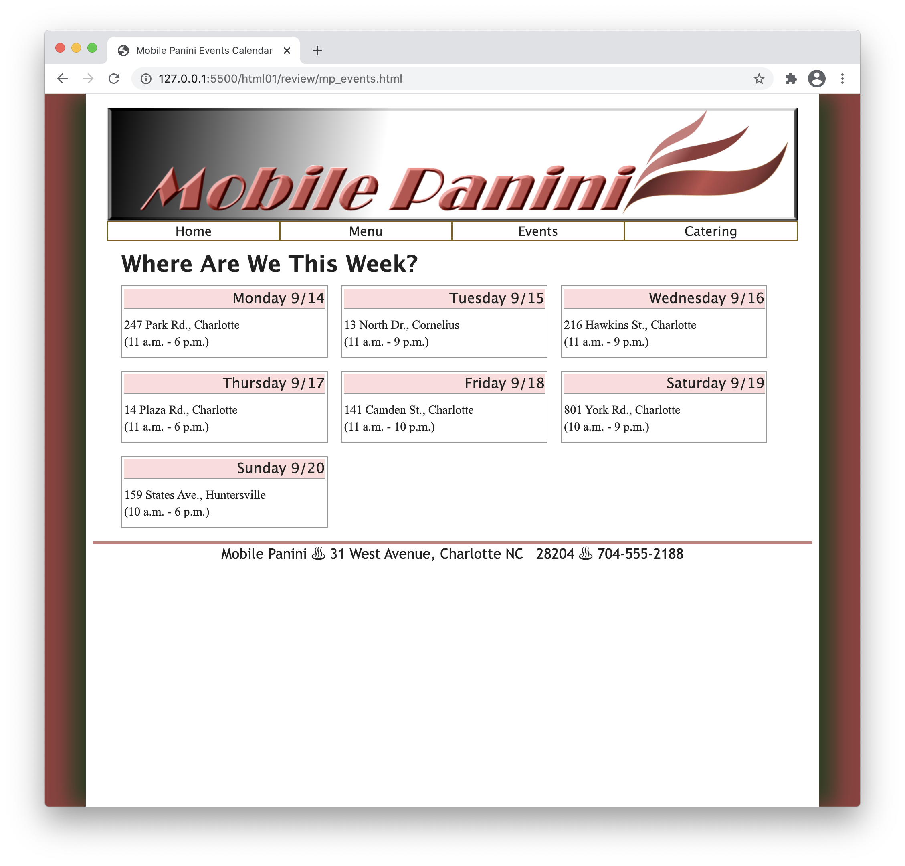
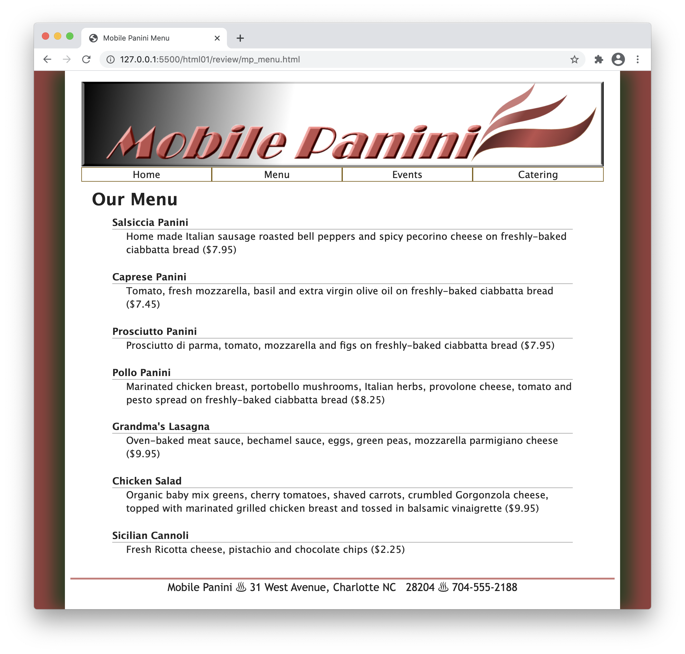

# t1-review
Mobile Panini

## Summary
Curbside Thai has partnered with another food truck vendor Mobile Panini. Sajja asks you to create a website for the company similar to what you did for his restaurant. The site will have a home page, an online menu, a description of catering opportunities, and a calendar of upcoming events that Mobile Panini will host. A preview of the home page is shown in *Figure 1-50*.





Figure 1-50

The page text has already been written for you and style sheets and graphic files have been created. Your job will be to complete this project by writing the HTML markup.

Save mp_index_txt.html as mp_index.html. Save mp_menu_txt.html as mp_menu.html. Save mp_events_txt.html as mp_events.html. Save mp_catering_txt.html as mp_catering.html

Open the *mp_index.html*, *mp_menu.html*, *mp_events.html*, and *mp_catering.html* files and enter your **name** and the **date** in the comment section of each file.

## Document Setup
Next, open to the *mp_index.html* file. Within the document ```head```, do the following:
1. Use the ```meta``` element to set the character encoding of the file to ```utf-8```.
2. Add the following search keywords to the document: **Italian**, **Mobile**, **food**, and **Charlotte**.
3. Set the title of the document to **Mobile Panini**.
4. Link the document to the *mp_base.css* and *mp_layout.css* style sheet files.

## Create the Navigation List
Go to the document ```body``` and insert a header element containing the following:

1. An inline image from the *mp_logo.png* file with the alternate text **Mobile Panini**. Mark the image as a hypertext link pointing to the *mp_index.html* file.
2. A navigation list containing an unordered list with the following list items: **Home**, **Menu**, **Events**, and **Catering**. Link the items to the *mp_index.html*, *mp_menu.html*, *mp_events.html*, and *mp_catering.html* files respectively.

## Add the Footer
Below the ```header``` element insert an ```article``` element. Below the ```article``` element, insert a ```footer``` element containing the following text: **Mobile Panini ♨ 31 West Avenue, Charlotte NC  28204 ♨ 704-555-2188** where ♨ is inserted using the character code ```&#9832;``` and an extra space is added between NC and 28204 using the ```&nbsp;```character code.

## Create the Homepage
Go to the *mp_pages.txt* file in your text editor. This file contains the text content of the four pages in the Mobile Panini website. Copy the text of the Welcome section, which will be used in the home page of the website. Return to *mp_index.html* in your HTML editor and paste the copied text into the article element.
Within the ```article element```, do the following:

1. Mark the "Welcome" line as an ```h1``` heading.
2. Below the ```h1``` element, insert an inline image containing the *mp_photo1.png* file with an empty text string for the alternate text.
3. Mark the next five paragraphs as paragraphs using the ```p```element. Within the first paragraph, mark the text **Mobile Panini** as strong text. Within the third paragraph mark the text **Curbside Thai** as emphasized text.
4. The fourth paragraph contains Mobile Panini's phone number. Mark the phone number as a telephone link and be sure to include the international code in the URL.
5. The fifth paragraph contains Mobile Panini's email address. Mark the email address as a hypertext link.

Note that the number and email address are fictional, so, if you have access to a mobile browser and want to test either link, you might want to replace the number or email address with your own.

## Verify Your Progress
Pause and verify that the layout and appearance of the page resemble that shown in *Figure 1-50*. If possible, test the telephone links and email links to verify that they open the correct application.

## Creating the Menu Page
Go to the *mp_index.html* file in your HTML editor, and copy the ```header``` and ```footer``` elements. Then go to the *mp_menu.html* file in your HTML editor and paste the ```header``` and ```footer``` elements into the ```body``` element so that this page has the same logo and navigation list and footer used in the home page. Insert an ```article``` element between the ```header``` and ```footer```.

Return to the *mp_pages.txt* file in your text editor and copy the contents of the Mobile Panini menu. Then, go to the *mp_menu.html*file in your HTML editor and paste the copied text into the ```article``` element.
Within the ```article``` element of the *mp_menu.html* file, do the following:

1. Mark the text title **Our Menu** as an ```h1``` heading.
2. Enclose the menu items in a description list with the name of each menu item marked with the ```dt``` element and each menu description marked with the ```dd``` element.

## Creating the Events Page
Go to the *mp_index.html* file in your HTML editor and copy the ```header``` and ```footer``` elements. Then, go to the *mp_events.html* file in your HTML editor and paste the ```header``` and ```footer``` elements into the ```body``` element. Insert an ```article``` element between the ```header``` and ```footer```.

Return to the *mp_pages.txt* file in your text editor and copy the list of upcoming events at the bottom of the file. Then, go to the *mp_events.html* file in your HTML editor and paste the copied text into the ```article``` element.
Within the ```article``` element, do the following:

1. Mark the text **Where Are We This Week?** as an ```h1``` heading.
2. Enclose each day&rsquo;s worth of events within a separate ```div``` (or division) element.
3. Within each of the seven day divisions, enclose the day and date as an ```h1``` heading.
4. Enclose the location within a paragraph element. Insert a line break element, ```<br />```, directly before the time of the event so that each time interval is displayed on a new line within the paragraph.

## Verify Your Progress
Pause and verify that the layout and appearance of the page resemble that shown in *Figure 1-50*. Verify that each calendar event appears in its own box with the day and date rendered as a heading.

## Create the Catering Page
Go to the *mp_index.html* file in your HTML editor and copy the ```header``` and ```footer``` elements. Then, go to the *mp_catering.html* file in your HTML editor and paste the ```header``` and ```footer``` elements into the ```body``` element. Insert an ```article``` element between the ```header```and ```footer``` and then insert an ```aside``` element within the ```article```.

Directly after the opening ```<article>``` tag, insert an ```h1``` element containing the text **Catering**.

Return to the *mp_pages.txt* file in your text editor and copy the text about the mobile kitchen, including the heading. Then, go to the *mp_catering.html* file in your HTML editor and paste the copied text into the ```aside``` element.

Within the ```aside``` element, do the following:

1. Mark the text **About the Mobile Kitchen** as an ```h1``` heading.
2. Mark the next two paragraphs as paragraphs.

Return to the **mp_pages.txt** file in your text editor and copy the text describing Mobile Panini's catering opportunities; do not copy the Catering head. Then, go to the **mp_catering.html** file in your HTML editor and paste the copied text directly after the ```aside``` element.

Make the following edits to the pasted text:

1. Mark the first two paragraphs as paragraphs.
2. Enclose the list of the six catering possibilities within an unordered list with each item marked as a list item.
3. Mark the concluding paragraph as a paragraph
